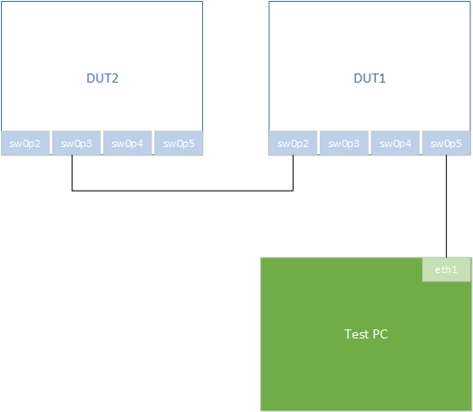

# Documentation for Target 'IPSOL-DE-Eval-Board'
## Test Setup
For this target, two DE-Eval-Boards are required, connected as shown in the following diagram:


## Device Configuration
DUT2 is assumed to be the gPTP grandmaster and the CIST root bridge.

This can be ensured for example by running
```
ssh root@${DUT2_IP_ADDR} deptp_tool --set-priority1 0
```
for defining DUT2 as the gPTP grandmaster and
```
ssh root@${DUT2_IP_ADDR} mstpctl settreeprio br0 0 0
```
for defining DUT2 as the CIST root bridge.

## Pitfalls
- if the CLI is used to configure priority1 on DUT2, the NETCONF datastore won't notice
that change, so the expected result is still the default value
- rerunning the tests twice in a row will cause some tests to fail:
    - /interfaces/interface/gate-parameters/config-change-time/seconds
    - /interfaces/interface/gate-parameters/config-change-time/fractional-seconds
    - /interfaces/interface/gate-parameters/config-change-error
    - /bridges/bridge/component/filtering-database/static-vlan-registration-entries
- expected fails:
  - /interfaces/interface/frame-preemption-parameters/hold-advance (see https://issues.tttech.com/browse/FLEXDE-5567)